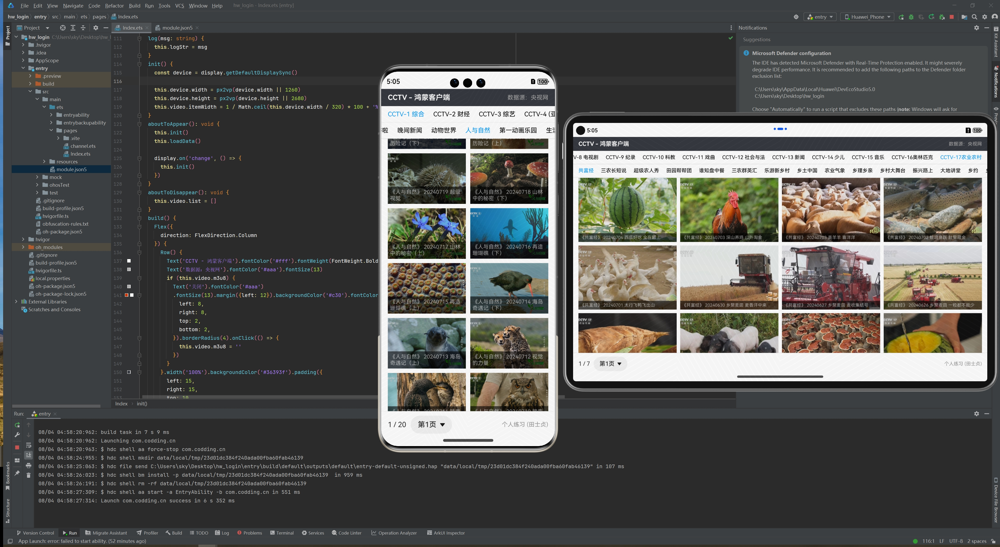

# 鸿蒙应用 - CCTV 非官方客户端

个人练习，仅供学习使用

<!-- C:\Users\sky\Desktop\hw_cctv\entry\src\main\resources\zh_CN\element -->

- 华为集团用72小时讲完的鸿蒙开发，整整300集，零基础入门，手把手教学，学完即可就业
- https://www.bilibili.com/video/BV1qx4y1e7Hd?p=4&vd_source=5da883fd136f2b89fea359654e4e79e4

- 全网首发黑马程序员鸿蒙 HarmonyOS NEXT星河版零基础入门到实战，零基础也能快速入门鸿蒙开发教程
- https://www.bilibili.com/video/BV14t421W7pA?p=23&vd_source=5da883fd136f2b89fea359654e4e79e4

- 【华为内部鸿蒙培训课程】鸿蒙4(ArkTS)入门到企业级教程，整整300集，学完精通鸿蒙应用开发！
- https://www.bilibili.com/video/BV12H4y1a7Qd/?p=25&spm_id_from=333.880.my_history.page.click&vd_source=5da883fd136f2b89fea359654e4e79e4

- 【整整560集】清华大学（2024最新版）C/C++教程，零基础入门到精通全套教程，全程干货无废话，这么好的课程还没人看？我不更！！！
- https://www.bilibili.com/video/BV1z4421U7ZT/?p=7&spm_id_from=333.880.my_history.page.click&vd_source=5da883fd136f2b89fea359654e4e79e4

- 桌面应用开发利器：Tauri快速上手
- https://www.bilibili.com/video/BV1gM4y1W7kM/?spm_id_from=333.880.my_history.page.click&vd_source=5da883fd136f2b89fea359654e4e79e4

- 「前端工程化」之 Rollup 上手与基本原理
- https://www.bilibili.com/video/BV1w84y1z77V/?p=4&spm_id_from=333.880.my_history.page.click&vd_source=5da883fd136f2b89fea359654e4e79e4

- 华为官方视频教程
- https://developer.huawei.com/consumer/cn/training/result?type1=101718934267126043